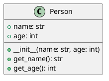

# UML

## Introduction to UML and PlantUML

- UML: Unified Modeling Language
- Visual representation of software systems
- PlantUML: Tool to create UML diagrams using text

## What is UML?

- Standardized modeling language
- Diagrams: Class, Sequence, State, Use Case, etc.
- Helps in design and documentation

## PlantUML Basics

- Text-based UML diagrams
- Easy to version control
- Generates diagrams in various formats

## Using PlantUML

- Download PlantUML jar file
- Use [online editors](plantuml.com)
- Integrate with IDEs

## Example: Class Diagram

## Exercise

- Create a simple class diagram for a `Car` class
- Attributes: `make`, `model`, `year`
- Methods: `start()`, `stop()`
