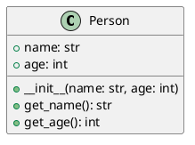

# UML

## Introduction to UML and PlantUML

- UML: Unified Modeling Language
- Visual representation of software systems
- PlantUML: Tool to create UML diagrams using text

## What is UML?

- Standardized modeling language
- Diagrams: Class, Sequence, State, Use Case, etc.
- Helps in design and documentation

---

{height=540px}

## Diagram Groups

- Structure (class diagram, etc)
- Behavior (activity diagram, etc)

---

---

{height=540px}

## PlantUML Basics

- Text-based UML diagrams
- Easy to version control
- Generates diagrams in various formats

## Using PlantUML

- Download PlantUML jar file
- Use [online editors](plantuml.com)
- Integrate with IDEs

## Example: Class Diagram

## Exercise

- Create a simple class diagram for a `Car` class
- Attributes: `make`, `model`, `year`
- Methods: `start()`, `stop()`

## Exercise

- Create a class diagram for `range`

<!--
@startuml
class range {
  +start: int
  +step: int
  +stop: int
  +__init__(start: int, stop: int, step: int)
  +count(value): int
  +index(value): int
}
@enduml
-->

## Exercise 

- Create a class diagram for `list`

<!--
@startuml
class list {
  +append(other)
  +clear()
  +copy()
  +count(value)
  +extend(other: list)
  +index(value): int
  +insert(value)
  +pop(position = 0: int): value
  +remove()
  +reverse()
  +sort()
}
@enduml
-->