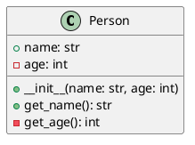
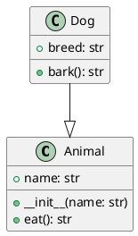

# UML class diagrams

## Class and Attribute Relationships

- Public and private attributes
- Inheritance and associations
- Aggregation and composition

## Public and Private Attributes

- Public: Accessible from outside the class
- Private: Accessible only within the class
- Convention: Prefix private attributes with `__`

## Example: Public and Private Attributes

## Inheritance

- `Child` class inherits from `Parent` class
- Use `--|>` to denote inheritance

## Example: Inheritance

## Exercise

- Create a class diagram for a `Vehicle` hierarchy
- Base class: `Vehicle`
- Derived classes: `Car`, `Bike`
- Attributes and methods as appropriate
