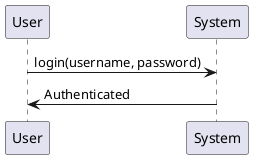
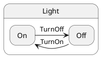

# Other UML Diagrams

## Sequence Diagrams

- Show interactions betweenObjects
- Use `participant` and `->` to denote interactions

## Example: Sequence Diagram

## Exercise

- Create a sequence diagram for a `BankAccount`class
- Methods: `deposit()`, `withdraw()`, `check_balance()`

## State Diagrams

- ShowStatesAndTransitions
- Use `state` and `->` to denote states and transitions

## Example: State Diagram

## Exercise

- Create a state diagram for a `TrafficLight`class
- States: `Red`, `Yellow`, `Green`
- Transitions: `Red -> Green`, `Green -> Yellow`, `Yellow -> Red`
