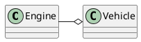

# Aggregation

## What is Aggregation?

- Objects contain other objects
- Objects can exist independently

## Example: Car and Engine

- Car has an Engine
- Engine can be replaced

## Aggregation

```python
class Engine:
    def start(self):
        return "Engine started"

class Car:
    def __init__(self, engine):
        self.engine = engine

    def start(self):
        return self.engine.start()

engine = Engine()
car = Car(engine)
print(car.start())
```

## Composition

```python
class Engine:
    def start(self):
        return "Engine started"

class Car:
    def __init__(self):
        self.engine = Engine()

    def start(self):
        return self.engine.start()

car = Car()
print(car.start())
```

## Exercise

Create a `Student` class and a `Course` class

- `Student` should have a name and age
- `Course` should have a name and a list of students

## UML



---


## Aggregation vs Composition

- Aggregation: Objects can exist independently
- Composition: Objects cannot exist independently

## Exercise

- Create a `Library` class
- `Library` should have a list of `Book` objects
- Add methods to add and remove books


## Aggregation vs Composition

- Aggregation: loose coupling
- Composition: strong ownership

## Exercise

- Create a `Company` class
- `Company` should have a list of employees
- Employees should have a name and position
- Add methods to hire and fire employees
