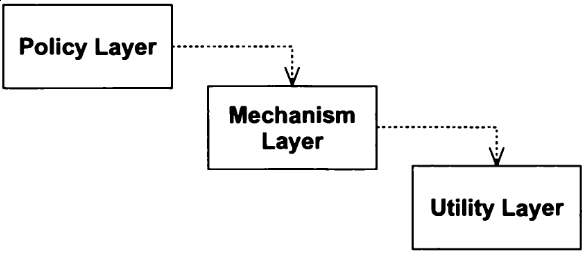

Dependency-Inversion Principle (DIP)
====================================

---

"D" in SOLID

---

High-level modules should not depend on low-level modules. Both should depend on abstractions.

---

Abstractions should not depend on details. Details should depend on abstractions.

---

> ...all well-structured object-oriented architectures have clearly defined layers, with each layer providing some coherent set of services though a well-defined and controlled interface.

---



Problems
--------

- Depending on lower layers can cause higher layers to break
- Higher layers may be less reusable

---


---

Lower-level modules implement interfaces that are owned by higher-level modules

---

Depend on abstractions
----------------------

- No variable should hold a reference to a concrete class
- No class should derive from a concrete class
- No method should override an implemented method of any of its base classes

---

More like guidelines than actual rules

QT Example
----------

> Qt (pronounced "cute") is a free and open-source widget toolkit for creating graphical user interfaces as well as cross-platform applications that run on various software and hardware platforms such as Linux, Windows, MacOS, Android or embedded systems

---

- [https://doc.qt.io/qt-6/classes.html](https://doc.qt.io/qt-6/classes.html)
- Explore the high-level class hierarchy of this framework.
- Consider how the principles that we have been discussing are used in practice.

Interface Segregation Principle (ISP)
=====================================

---

"I" in SOLID

---

Some classes have complex interfaces

---

Many clients use only a group of class methods

---

These clients should know about abstract base classes representing cohesive interfaces

---

ISP: Clients should not be forced to depend on methods that they do not use.

---

Create multiple abstract classes and use multiple inheritance

---

```python
class Animal:
  def run(self)
  def fly(self)
  def eat(self)

class Dog(Animal):
  # May need to change if flight behavior changes
```

---

```python
class Flyer:
  def fly(self)

class Runner:
  def run(self)

class Eater:
  def eat(self)

class Dog(Runner, Eater):
  # Never cares about flight behavior
```

When adding features to a class, we may instead opt to add a new interface.

Traits
======

Rust
----

> Rust is a multi-paradigm system programming language focused on safety, especially safe concurrency. Rust is syntactically similar to C++, but is designed to provide better memory safety while maintaining high performance

---

> Rust was originally designed by Graydon Hoare at Mozilla Research, with contributions from Dave Herman, Brendan Eich, and others. The designers refined the language while writing the Servo layout or browser engine 

Rust classes
------------

Rust has no classes

Composition vs Inheritance
--------------------------

Rust favors composition over inheritance

Rust Traits
-----------

> A trait is a language feature that tells the Rust compiler about functionality a type must provide.

Prototypical Inheritance
========================

---

```javascript
let animal = {
  eats: true
}
let bird = {
  flies: true
}

bird.__proto__ = animal
```

---

```javascript
a = [1, 2]
Array.prototype.first = function () { return this[0] }
a.first()
```

---

```javascript
a = [1, 2]
a.push(3)
console.log(a)
Array.prototype.push = function () { }
a.push(4)
console.log(a)
```
